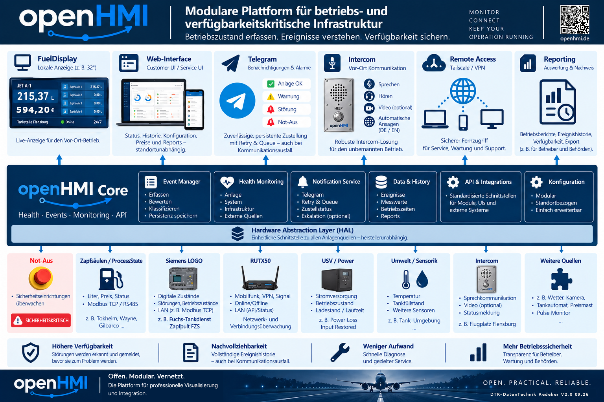

# openHMI


**OpenHMI is an open-source operational monitoring and HMI platform for distributed technical installations.**

It combines local visualization, process data, system health, remote access and integrations into one modular platform.

OpenHMI started as a practical solution for fuel-station visualization and is evolving into a reusable platform for industrial and infrastructure applications where **availability, transparency and maintainability matter**.

> **Open. Practical. Reliable.**

## What OpenHMI is about

A technical installation can continue to work without a monitoring platform — but the operator then often does not know **whether it is working correctly, what happened during an incident, or where to start troubleshooting**.

OpenHMI is designed to create a common operational picture from heterogeneous technical systems:

```text
Sources
   ↓
OpenHMI Core
   ↓
Health / Events / Process State
   ↓
Display / Web / Notifications / Remote Service
```

The platform follows a simple operational idea:

```text
Understand the installation
→ acquire states
→ evaluate relevant conditions
→ preserve useful history
→ report deviations
→ support diagnosis
→ make availability visible
```

## Platform overview

The current OpenHMI platform overview is available as **Version 2.0**:

[OpenHMI Platform Overview V2.0 (PDF)](media/openHMI_A4_Uebersicht_v2.0.pdf)



The previous **Version 1.1** is kept for reference:

[OpenHMI Platform Overview V1.1 (PDF)](media/openHMI_A4_Uebersicht_v1.1.pdf)

## Core principles

- **Modular architecture** — applications and data sources remain replaceable.
- **Protocol independence** — applications do not depend directly on field protocols.
- **Local-first operation** — core functionality must not depend on Internet or cloud availability.
- **Industrial practicality** — field reliability is more important than feature count.
- **Open core** — the reusable platform remains open while project-specific applications and hardware may use different licensing models.
- **Remote maintainability** — secure service access is considered from the beginning.
- **No unnecessary vendor lock-in** — standard protocols and replaceable components are preferred.
- **Read-only monitoring first** — monitoring and diagnostics must not become part of a safety chain.

## Current architecture

```text
Field / Infrastructure Sources

Process data · RS485/Modbus · controllers · network devices · sensors
                           ↓
                    Hardware / Adapters
                           ↓
                    OpenHMI Core
      ┌────────────────────┼────────────────────┐
      │                    │                    │
 Process State        System Health       Notifications
      │                    │                    │
      └────────────────────┼────────────────────┘
                           ↓
        Applications / Interfaces / Service

      FuelDisplay · Web UI · Telegram · Remote Access
```

OpenHMI runs on Linux-based edge systems. Raspberry Pi is the current primary platform, while the architecture is intended to remain portable to other Linux systems.

## Current components

### Local HMI

- Chromium kiosk operation
- web-based applications
- local configuration
- fullscreen visualization for dedicated displays

### Process data

- standardized process-state representation
- multiple data sources
- source availability and data-age monitoring
- protocol adapters separated from applications

### System Health

Current health monitoring can evaluate, among other things:

- system uptime
- systemd service state
- CPU temperature
- throttling / undervoltage state
- RAM and filesystem usage
- network availability
- remote-access state
- time synchronization
- process-source availability and data age

The health model uses the states:

```text
OK
WARN
ERROR
```

### Remote access

The current administrative model is based on:

```text
Tailscale network
      ↓
standard OpenSSH
      ↓
client-specific SSH identities
```

No public inbound SSH port is required.

### Notifications

Telegram is currently the first notification transport. Notification handling is intentionally kept transport-neutral so additional transports can be added later.

Remote commands are limited to read-only operational information such as status, health and source state.

## Applications

### FuelDisplay

FuelDisplay is the first productive OpenHMI application.

It visualizes live fueling information and can switch automatically between idle price display and active fueling views.

The application consumes normalized process data instead of depending directly on a dispenser protocol.

This separation is a fundamental OpenHMI design principle:

```text
Field protocol / device
        ↓
Adapter / Gateway
        ↓
normalized Process State
        ↓
Application
```

## OpenHMI in the field

The project is already running on real hardware in field-test and commissioning environments.

| FuelDisplay prototype | FuelDisplay field test |
| --- | --- |
|  |  |

Additional field images are available in the [`media/`](media/) directory.

## Planned platform evolution

Development is active. Current priorities include:

- persistent event history
- reliable store-and-forward notifications
- additional infrastructure integrations
- customer-facing web interfaces
- reporting
- standardized hardware health integration
- additional industrial data sources

The goal is not to build every feature into one monolithic application. OpenHMI should provide a stable common core to which sources and interfaces can be added independently.

## Example use cases

- fuel-station and tank-installation monitoring
- industrial HMI systems
- distributed technical infrastructure
- building and energy monitoring
- remote service and diagnostics
- equipment-status dashboards
- edge gateways
- infrastructure monitoring

## Repository structure

The OpenHMI project is split into multiple repositories so that the reusable platform, applications, hardware and documentation can evolve independently.

This repository contains the **public OpenHMI documentation**.

Architecture decisions are maintained internally during active development and may be published here selectively when they are suitable as stable public documentation.

## Documentation

- [Architecture](architecture.md)
- [Project Rules](project_rules.md)
- [Remote Access Setup](remote-access-setup.md)
- [ESP32-C3 Development Notes](development.md)

## Project status

**Status: Active development**

OpenHMI is already running in real hardware and field-test environments. Interfaces and architecture are still evolving, so documentation may change as operational experience is incorporated.

## Licensing

The licensing model is deliberately split by asset type:

- **Documentation:** CC BY-SA 4.0 unless otherwise noted
- **Software:** licensed separately in the respective source repositories; the reusable OpenHMI core is intended to use GPL-3.0 unless stated otherwise
- **Media, photographs, overview sheets, logo and brand assets:** © DTR-DatenTechnik Redeker, all rights reserved unless explicitly stated otherwise

See [LICENSE.md](LICENSE.md) and [media/LICENSE.md](media/LICENSE.md) for details.

## Commercial use

OpenHMI is intended to support commercial deployments and professional integration services.

Possible models include:

- industry-specific applications
- hardware appliances
- integration services
- custom development
- support and maintenance
- remote monitoring and management

The platform can be open while solutions built on top of it remain open or proprietary according to project requirements.

---

**OpenHMI — operational visibility for technical infrastructure.**
